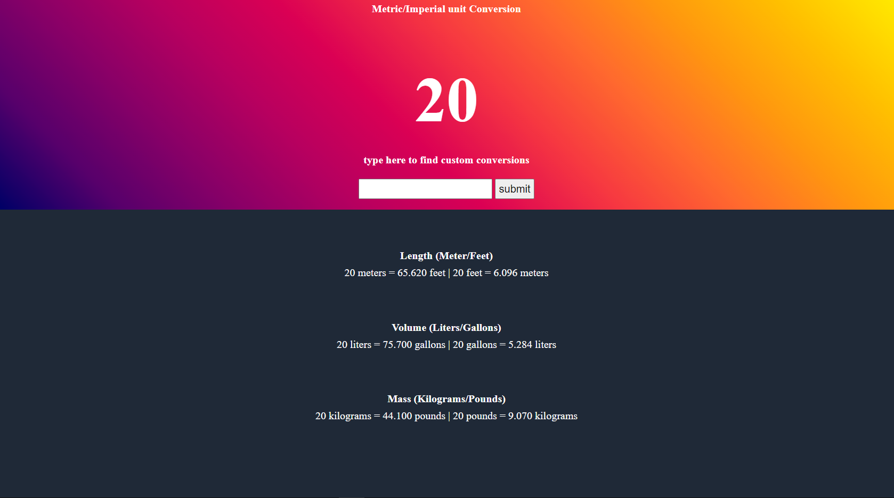

# Unit Conversion

## Table of contents

- [Overview](#overview)
  - [Screenshot](#screenshot)
  - [Links](#links)
- [My process](#my-process)
  - [Built with](#built-with)
  - [What I learned](#what-i-learned)
  - [Continued development](#continued-development)
  - [Useful resources](#useful-resources)
- [Author](#author)
- [Acknowledgments](#acknowledgments)

## Overview
A simple unit converter that converts imperial to metric or metric to imperial. The default is 20 for all units, but the user can input their own measurements to be converted.
### Purpose

Users should be able to:

- Input information into the input field and receive the conversions for their number.

### Screenshot
The default layout is when the page is loaded.

What it looks like when the user puts input in.


### Links

- Solution URL: [Add solution URL here](https://your-solution-url.com)
- Live Site URL: [Add live site URL here](https://your-live-site-url.com)

## My process
First, I created the HTML elements and selected them through Javascript so I could manipulate them through the DOM.
I created the formulas for each conversion and store them into a variable.
Then, I created a function that converts the values and sets the text content of the unit to the converted numbers.
To allow users to input their own values, I created input and button and added a click event to the button that grabs the value of the input and runs the conversion function.


### Built with

HTML5/CSS3/Vanilla Javascript

### What I learned

I learned how to use the DOM and how you can use querySelector to grab specific elements, classes, ids, or any other attribute.
I learned about the different properties that you can use on Input elements.
```js
const number = document.querySelector('#number-to-convert');
// querySelector grabs the ID of number-to-convert. 
const userNumber = input.value;
// input.value is the number(value) a user puts into the number input field.
```

### Continued development
Some media queries to make it mobile and tablet friendly.

### Useful resources

- [CSS Gradient Generator](https://www.joshwcomeau.com/gradient-generator/) - A cool tool that can create gradients for you and give the CSS needed to create them.

## Author

- Website - [My blog: HarpCode](https://harpcode.tech/)

- Twitter - [@hobjohn61](https://twitter.com/hobojohn61)


## Acknowledgments
